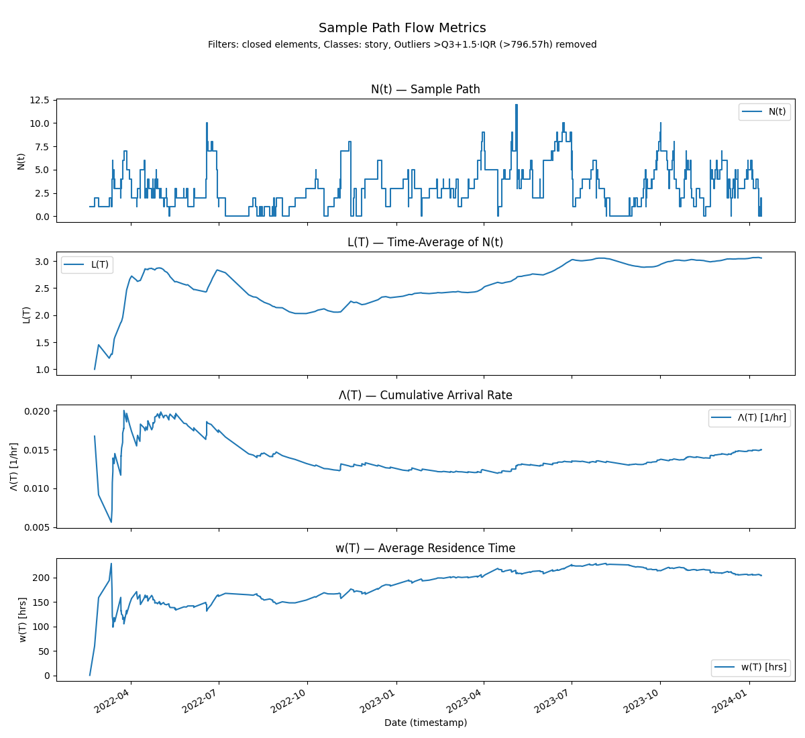

# The Sample Path Analysis Library and Toolkit

A reference implementation of sample-path flow metrics, convergence 
analysis, and stability diagnostics for flow processes in
complex adaptive systems.

[](https://pypi.org/project/samplepath/)
[](LICENSE)
[](https://py.pcalc.org)


______________________________________________________________________

# 1. Overview

**samplepath** is a Python library for analyzing _macro dynamics_ of flow
processes in complex adaptive systems. It provides
deterministic tools to precisely describe the _long-run_ behavior of stochastic flow
processes: 

- Arrival/departure equilibrium
- Process time coherence, and 
- Process stability 

using the finite-window formulation of 
**Little’s Law**.

The focus of the analysis is a single
_sample path_ of a flow process:
a _continuous_ real-valued function that describes a particular process behavior
when observed over a long, but finite period of time.

A key aspect of this
technique is that it is _distribution-free_. It does not require well-defined
statistical or probability distributions to reason rigorously about a flow process. Please
see [sample path analysis is not a statistical method](docs/src/not_statistics.md)
for more details.

As a result, this technique allows us to extend many results from stochastic
process theory to processes operating in complex adaptive systems, where stable
statistical distributions often don't exist. Our focus is
operations management in software development, but the techniques here are much
more general.

## History and Origins

The ideas behind sample path analysis are not new. The formal theory has been 
worked out thoroughly by researchers in stochastic process theory
and has been stable for over 30 years. They are just not familiar in the
software industry. 

Dr. Shaler Stidham discovered the technique when
he provided the first deterministic proof of Little's Law in 1972. So the 
core ideas here are nearly 60 years old! See our post
[A Brief History of Little's Law](https://www.polaris-flow-dispatch.com/p/a-brief-history-of-littles-law)
for a high level overview of the origins of this technique and it's
deep connection to Little's Law.

In the years since Dr. Stidham and other 
researchers in stochastic process theory have shown the power and versatility
of this technique to provide deterministic sample path oriented results
of many classical results in queueing theory that required very stringent 
probabilistic assumptions like stationarity and ergodicity to prove previously. 

The canonical reference detailing this work is the
textbook [Sample Path Analysis of Queueing Systems](https://www.researchgate.net/publication/303785171_Sample-Path_Analysis_of_Queueing_Systems)
by Muhammed El-Taha and Shaler Stidham (a downloadable PDF is available at the
link). 

This package directly implements many of the concepts in this textbook. 

## Why this is significant

Conditions like non-stationarity and non-ergodic behavior and lack of stable
distributions are
_exactly_ the dividing line between complex adaptive systems and simpler,
ordered systems when viewed from an operations management lens. 

There are several capabilities we get from this: 

- We can precisely define, measure and reason about properties such as 
  equilibrium,  coherence and stability, using real-world operational data 
  from complex adaptive systems. 
- We can retrospectively reason about cause and effect in observed behavior 
  of these operational processes, and do so in a deterministic fashion. 
- Naturally model and reason about processes with state, history and path 
  dependent behavior which are the norm in complex systems.  

Thus sample path analysis is _the_ technical bridge to rigorously model and 
measure flow processes in complex
adaptive systems. 

---

# 2. Core Concepts

Please see
our continuing series on Little's Law and sample path analysis at [The Polaris Flow Dispatch](https://www.polaris-flow-dispatch.com) for
accessible overviews of the theory.

In particular,

- [The Many Faces of Little's Law](https://www.polaris-flow-dispatch.com/p/the-many-faces-of-littles-law).
- [Little's Law in a Complex Adaptive System](https://www.polaris-flow-dispatch.com/p/littles-law-in-a-complex-adaptive)

cover most of the background needed to work with this library at a high level.

The example analyses in these posts were produced using this library
and can be found in the [examples](./examples/polaris) directory together with their original source data.

Please subscribe to [The Polaris Flow Dispatch](https://www.polaris-flow-dispatch.com) if you are interested in staying
abreast of developments and applications of these concepts. 

## Flow processes

A [flow process](https://www.polaris-flow-dispatch.com/i/172332418/flow-processes) is simply a timeline of events from some 
underlying operational domain, where
events have *effects* that persist beyond the time of the event. 
The  effects are encoded using
metadata (called marks) to describe them. The generality of the model comes from the fact that marks
can be arbitrary real-valued functions of time that meet some very weak requirements.

Typically data for analyzing a flow process are extracted from 
real-time transaction logs of digital operations management tools.

The current version of the library only supports the _offline_ analysis of 
_binary flow processes_. These are
flow processes where the marks denote the start or end of an observed presence of a domain element within some system boundary.

All queueing processes fall into this category, as do a much larger class of general input-output processes.
These are the simplest kind of flow processes we analyze in the presence calculus, but they cover the vast
majority of operational use cases we currently model in software delivery, so we will start there.
They are governed by the L=λW form of Little's Law.

We highly recommend reading [The Many Faces of Little's Law](https://www.polaris-flow-dispatch.com/p/the-many-faces-of-littles-law) for background on these concepts.

## Data Requirements

The data requirements for the analysis
of a flow process are minimal: a CSV file that represents the observed
timeline of a binary flow process with element ID, start, and end date columns.

- The start and end dates may be empty, but for a meaningful analysis, we
  require at least some of these dates be non-empty. Empty end dates denote
  elements that have started but not ended. Empty start dates denote items whose
  start date is unknown. Both are considered elements currently present in the
  boundary.
- The system boundary is optional (the name of the CSV file becomes the default name
  of the boundary). Boundaries become useful when we start to model the dynamics
  of interconnected flow processes. 

Given this input, this library implements:

A. Core Python modules that implement the computations for sample path construction and analysis:

- Time-averaged flow metrics governed by the finite version of Little's Law
  `N(t)`, `L(T)`, `Λ(T)`, `w(T)`, `λ*(T)`, `W*(T)`
- Performing *equilibrium* and **coherence** calculations (e.g., verifying `L(T) ≈ λ*(T)·W*(T)`)
- Estimating empirical **limits** with uncertainty and **tail** checks to verify stability (alpha)


B. Command line tools provide utilities that wrap these calculations

- Simple workflows that take CSV files as input to run sample path analysis with a rich set of parameters and options.
- Generate publication-ready **charts and panel visualizations** as static png files.
- The ability to save different parametrized analyses from a single CSV file as named scenarios.


## Key Metrics

Deterministic, sample-path analogues of Little’s Law:

| Quantity | Meaning                                               |
| -------- | ----------------------------------------------------- |
| `L(T)`   | Average work-in-process over window `T`               |
| `Λ(T)`   | Cumulative arrivals per unit time up to `T`           |
| `w(T)`   | Average residence time over window `T`                |
| `λ*(T)`  | Empirical arrival rate up to `T`                      |
| `W*(T)`  | Empirical mean sojourn time of items completed by `T` |

These quantities enable rigorous study of **equilibrium** (arrival/departure rate convergence), **coherence** (residence time/sojourn time convergence), and **stability** (convergence of process measures to limits) even when processes operate far from steady state.

Please see [Sample Path Construction](https://www.polaris-flow-dispatch.com/i/172332418/sample-path-construction-for-l%CE%BBw)
for background on what these metrics mean. 

Please see [Little's Law in a Complex Adaptive System](https://www.polaris-flow-dispatch.com/p/littles-law-in-a-complex-adaptive) for a worked example
on how to apply the concepts.

## Chart Reference 

For a detailed reference of the computations, charts and visualizations produced by sample path
analysis, please see the [Chart Reference](docs/src/chart_reference.md).

---

# 3. Installation (End Users)

## Quick Start with uv (Recommended)

**uv** is a fast, modern Python package manager that handles your setup.

### 1. Install uv

- **macOS / Linux:**

  ```bash
  curl -LsSf https://astral.sh/uv/install.sh | sh
  ```

- **Windows:**

  ```bash
  powershell -ExecutionPolicy ByPass -c "irm https://astral.sh/uv/install.ps1 | iex"
  ```

### 2. Install the samplepath CLI globally

```bash
uv tool install samplepath
```

This will install Python automatically if needed and make `samplepath` available globally.

### 3. Verify installation

```bash
samplepath --help
```

If this prints the help message, you're ready to go. 

**Note:** On some machines the very first time you run this command it might 
take 8 to 10 seconds to complete due to the plotting library downloading fonts. 
Subsequent calls should be fine. 


### Alternative: Run without installation

You can also run samplepath directly without installing it globally using `uvx`:

```bash
uvx samplepath events.csv --help
```

### Alternative: Use pip and pipx
If you already have a Python 3.11+ environment and don't want to switch package managers,
the standard installs via pip and pipx will also work.

Using pip
```bash
pip install samplepath
samplepath --help
```

Using pipx (for end users/global CLI usage)
```bash
pipx install samplepath
samplepath --help
```

To upgrade later

```bash
pipx upgrade samplepath
```

---

# 4. Usage

The complete CLI documentation is [here](docs/src/cli.md). Here are a few examples.

```bash
# Analyze completed items, save analysis to the output-dir under the scenario name shipped. Clean existing output directories
samplepath events.csv --output-dir spath-analysis --scenario shipped --completed --clean

# Pass an explicit date format (example below shows the typical case for non-US date formats).
# We use standard Python date formats: https://docs.python.org/3/library/datetime.html#format-codes

samplepath events.csv --date-format "%d/%m/%Y" --output-dir spath-analysis --scenario shipped --completed --clean

# Limit analysis to elements with class story
samplepath events.csv --class story

# Apply Tukey filter to remove items with outlier sojourn times before analysis of completed items
samplepath events.csv  --outlier-iqr 1.5 --completed
```

## 📂 Input Format

The input format is simple. 

The csv requires three columns

- _id_: any string identifier to denote an element/item
- _start_ts_: the start time of an event
- _end_ts_: the end time of an event

Additionally you may pass any other columns. They are all ignored for now, except for a column called _class_ which
you can use to filter results by event/item type. 

- If your csv has different column names, you can map them with  `--start_column` and `--end_column` options.
- You might need to explicitly pass a date format for the time stamps if you see date parsing errors. The `--date-format` argument does this. 

Results and charts are saved to the output directory as follows:
- The default output directory is  "charts" in your current directory.
- You can override this with the --output-dir argument. 

See the [CLI Documentation](docs/src/cli.md) for the full list of command line options. 

## 📂 Output Layout

For input `events.csv`, output is organized as:

```bash
<output-dir>/
└── events/
    └── <scenario>/                 # e.g., latest
        ├── input/                  # input snapshots
        ├── core/                   # core metrics & tables
        ├── convergence/            # limit estimates & diagnostics
        ├── convergence/panels/     # multi-panel figures
        ├── stability/panels/       # stability/variance panels
        ├── advanced/               # optional deep-dive charts
        └── misc/                   # ancillary artifacts
```
--

A complete reference to the charts produced can be found [here]
(docs/src/chart_reference.md).

---

# 5. Goals for this toolkit

This package is a part
of [The Presence Calculus Project](https://docs.pcalc.org): an open source
computational toolkit that is intended to make sample path methods and concepts more
accessible to practitioners working on operations management problems in the software
industry including engineering/product/sales/marketing operations and related disciplines: value
stream management, developer experience and platforms, and lean continuous process improvement.

This library and toolkit is intended to be used by practitioners to 
understand the theory and _develop their intuition about the dynamics of flow 
processes_, using their own environments.  Understanding the context behind 
the data greatly helps makes the abstract ideas here concerete and there in 
no substitute for getting your hands dirty and trying things out directly. 
This toolkit is designed for that. 

It is not ready nor intended to support production quality operations management tooling. 

## In Scope

You will get the most benefits out of this library in the near term by using 
it to  look closely and carefully, at how flow processes in your environment behave and 
evolve using the machinery of this package and learning how to model them. 

The toolkit is intentionally designed to be low-tech and force you think
about how to model flow processes in a complex system more broadly before 
jumping to talking about metrics and building dashboards.

You should be able to apply it anywhere you can extract a csv file with 
start and end dates for various operational processes using the native 
reporting tools built into the production tools you use today.  

Compare what you see here, with whatever your current operational dashboards 
show today and think about the differences. It will soon become apparent 
why sample path analysis represents a fundamentally different way of thinking about flow and operations management.

We will continues to provide more examples and talking about applications
in The Polaris Flow Dispatch so it becomes easier to imagine the possibilities.
But the potential applications are really very large so we welcome contributions
from others who have interesting examples to show once they grasp the ideas
here and understand why they matter.

The barrier to modeling and measuring a flow process using this toolkit are
minimal. So please try it out and see what you find.  I would love to publish 
your use  cases. Please raise a 
PR to tell us if you have a novel use case and show us how you are using 
these techniques.

We plan to extend this library to support the analysis of
general flow processes, which allow arbitrary functions as marks, and are governed by the H=λG form of Little's Law. This
will allow us to directly model the economic impacts of flow processes.

## Out of scope

We do _not_ plan to directly implement online analysis of real time flow 
processes in this package nor build web apps or UIs here in this package. It will remain an 
offline, command line toolkit for the foreseeable future.  

However, the underlying modules implement the low-level machinery and 
code required to build these more production ready and richer applications, and 
our licensing permits you to build those applications using the concepts in this package if 
you so desire.

---

# 6. Development Setup (for Contributors)

Developers working on **samplepath** use [uv](https://docs.astral.sh/uv/) 
for dependency and build management.

### Prerequisites

Install uv following the [Quick Start](#quick-start-with-uv-recommended) section above.

### 1. Clone and enter the repository

```bash
git clone https://github.com/krishnaku/samplepath.git
cd samplepath
```

### 2. Sync development dependencies

```bash
uv sync --all-extras
```

This creates a virtual environment and installs all dependencies (including dev dependencies) based on `uv.lock`.

### 3. Run tests

```bash
uv run pytest
```

### 4. Code quality checks

```bash
uv run black samplepath/      # Format Python code
uv run isort samplepath/      # Sort imports
uv run mypy samplepath/       # Type checking
uv run mdformat .             # Format markdown files
```

### 5. Run the CLI from source

During development, run samplepath directly from the source code:

```bash
uv run samplepath examples/polaris/csv/work_tracking.csv --help
```

### 6. Build and publish (maintainers)

To build the distributable wheel and sdist:

```bash
uv build
```

To upload to PyPI (maintainers only):

```bash
uv publish
```

## 📦 Package Layout

```bash
samplepath/
├── cli.py               # Command-line interface
├── csv_loader.py        # CSV import utilities
├── metrics.py           # Empirical flow metric calculations
├── limits.py            # Convergence and limit estimators
├── plots.py             # Chart and panel generation
└── tests/               # Pytest suite
```

______________________________________________________________________

# 7. Documentation

Further documentation will be added to this repo. In the meantime, use the
documentation links provided at the top of this README.

______________________________________________________________________

# 8. License

Licensed under the **MIT License**.\
See `LICENSE` for details.

Copyright (c) 2025 Dr. Krishna Kumar
