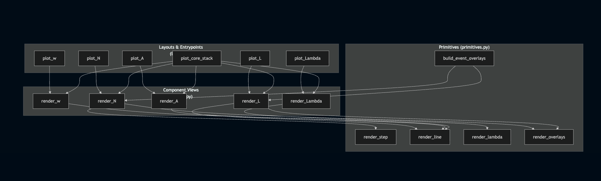

# ADR-003: Plot Call Chain Simplification (Layered Layout/View/Render)

**Status:** Proposed  
**Date:** 2026-02-03  
**Author:** Krishna Kumar  

## Context

ADR-002 centralized chart rendering into low-level renderers and chart recipes, but the call chain still mixes responsibilities and naming (`draw_*`, `render_*`, `plot_*`) across layers. The current code (ADR-002 state) is Matplotlib-specific and lacks a clean separation between:
- Rendering primitives (step/line/lambda + overlays)
- Chart-specific views (N, L, Λ, w) that assemble styling/overlays
- Layout/entrypoints (standalone vs composite stacks)

We also want clearer naming and a consistent layering to avoid function proliferation.

## Decision

Introduce a three-layer structure with consistent naming (with review updates):

1. **Primitives (renderers):** Backend-adjacent functions that draw basic series and overlays on an existing axis.
2. **Component Views (recipes):** One per metric (N, L, Λ, w, A) that set titles/labels, build overlays, choose colors, and call primitives.
3. **Layouts/Entrypoints:** Standalone and composite functions that create figures/layouts and delegate to views; save/output concerns live here.

### Proposed function names and responsibilities

**Layer 1: Primitives (`primitives.py`)**
- `render_step(ax, times, values, *, label, color, fill=False, overlays=None)`
- `render_line(ax, times, values, *, label, color, overlays=None)`
- `render_lambda(ax, times, values, *, label, clip_opts: ClipOptions | None = None, color="tab:blue")` (Lambda-specific clipping)
- `render_overlays(ax, overlays)` (shared scatter/drop-line helper used by step/line)
- `build_event_overlays(times, values, arrival_times, departure_times, drop_lines=True)`

**Layer 2: Component Views (`charts.py`)**
- `render_N(ax, times, N_vals, *, arrival_times=None, departure_times=None, with_event_marks=False, show_title=True)`
- `render_L(ax, times, L_vals, *, arrival_times=None, departure_times=None, with_event_marks=False, show_title=True)`
- `render_Lambda(ax, times, Lam_vals, *, clip_opts: ClipOptions | None = None, show_title=True)`
- `render_w(ax, times, w_vals, *, show_title=True)`
- `render_H(ax, times, H_vals, *, show_title=True)`

Views:
- Build overlays from explicit arrival/departure times when requested; map event x-values to series y-values.
- Choose colors (e.g., grey when overlays present) and labels/titles.
- Call only Layer 1 primitives.
- Avoid figure creation or saving; minimal x-axis formatting (left to layouts).

**Layer 3: Layouts/Entrypoints (`layouts.py`)**
- Standalone: `plot_N`, `plot_L`, `plot_Lambda`, `plot_w`, `plot_H` (create fig/ax, call view, format/save).
- Composite: `plot_core_stack` (orchestrates N, L, Λ, w panels; shared x-axis formatting, captions).
- Only call Layer 2 views; no direct primitive calls.

### Naming rules
- Primitives: `render_*` (step/line/lambda/overlays), `build_event_overlays`.
- Views: `render_N`, `render_L`, `render_Lambda`, `render_w`, `render_H`.
- Layout/entrypoints: `plot_*` for standalones and `plot_core_stack` for composites.
- No other `draw_*`/`render_*` variants; composites do not call primitives directly.

### Shared types/utilities
- `ClipOptions` dataclass for Lambda clipping (`pctl_upper`, `pctl_lower`, `warmup_hours`).
- `ScatterOverlay` dataclass (already exists) remains the first overlay type.
- Shared helpers (e.g., `build_event_overlays`, `format_date_axis`) can live in `helpers.py`/`common.py`.

### Diagram

See `decisions/diagrams/003.1-plot-call-chain-proposed.md` for a visual call chain of the proposed layering (updated names).

## Consequences

**Positive**
- Clear separation of concerns: primitives vs metric views vs layouts.
- Reduced naming confusion; easy to see where to add features (e.g., overlays/colors in views, not layouts).
- Simplifies future backend abstraction (primitives can map to a `RenderBackend` later).

**Neutral/Negative**
- Requires renaming/refactoring existing `draw_*` functions to `plot_*`.
- Additional indirection (layout → view → primitive) but simpler mental model.

## Migration Plan

1. Create module structure: `primitives.py`, `charts.py`, `layouts.py`, shared `helpers.py` (types/utilities).
2. Move/refactor primitives to `primitives.py`: `render_step`, `render_line`, `render_lambda`, `render_overlays`; keep `build_event_overlays`.
3. Implement chart views in `charts.py`: `render_N`, `render_L`, `render_Lambda` (using `ClipOptions`), `render_w`, `render_H`.
4. Implement layouts in `layouts.py`: `plot_N`, `plot_L`, `plot_Lambda`, `plot_w`, `plot_H`, `plot_core_stack` (and any variants), delegating only to views.
5. Update callers (`core.py`, `stability.py`, `convergence.py`, etc.) to use the new entrypoints; remove or deprecate old `draw_*`/`render_*` variants.
6. Update/add tests to target each layer: primitives (call args), views (overlay/color/title/clipping decisions), layouts (delegation and shared formatting).
7. Keep Matplotlib implementation; backend-agnostic `ChartSpec`/`RenderBackend` remains future work (post-refactor).

## Status vs ADR-002

ADR-002’s current state introduced centralized recipes but still mixed names and layers. ADR-003 proposes the clean three-layer split and naming (per review updates); implementation will align code and tests to this structure without changing visual output or behavior. Decisions to use `ClipOptions`, explicit arrival/departure params, and the final function/module names are incorporated above.

## Migration mapping (ADR-002 → ADR-003)

| Current (ADR-002) | Proposed (ADR-003) | New Location |
|-------------------|--------------------|--------------|
| `render_step_chart` | `render_step` | primitives.py |
| `render_line_chart` | `render_line` | primitives.py |
| `render_lambda_chart` | `render_lambda` | primitives.py |
| (inline overlay logic) | `render_overlays` | primitives.py |
| `build_event_overlays` (exists) | `build_event_overlays` | primitives.py / helpers.py |
| `render_N_chart` | `render_N` | charts.py |
| `render_LT_chart` | `render_L` | charts.py |
| (new) | `render_Lambda` | charts.py |
| (new) | `render_w` | charts.py |
| (new) | `render_H` | charts.py |
| `draw_N_chart` | `plot_N` | layouts.py |
| `draw_LT_chart` | `plot_L` | layouts.py |
| `draw_four_panel_column` | `plot_core_stack` | layouts.py |
| `draw_five_panel_column` | `plot_five_panel_stack` (if retained) | layouts.py |

## Final layer structure (modules)

| Layer | Module | Functions | Responsibility |
|-------|--------|-----------|----------------|
| 1. Primitives | `primitives.py` | `render_step`, `render_line`, `render_lambda`, `render_overlays`, `build_event_overlays` | Draw series + overlays on axes |
| 2. Charts | `charts.py` | `render_N`, `render_L`, `render_Lambda`, `render_w`, `render_H` | Complete chart definition (title, ylabel, colors, overlay logic) |
| 3. Layouts | `layouts.py` | `plot_N`, `plot_L`, `plot_Lambda`, `plot_w`, `plot_H`, `plot_core_stack` | Create figure, call charts, format axes, save |
| Shared | `helpers.py` (or `common.py`) | `ClipOptions`, `ScatterOverlay`, `format_date_axis` | Data types and utilities |
