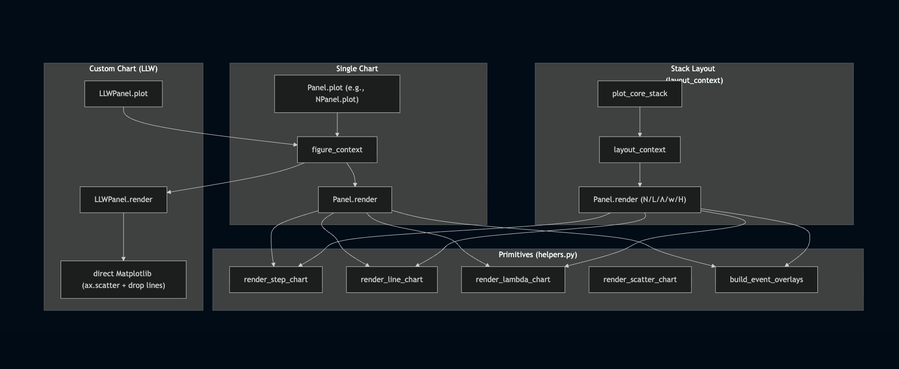

# ADR-006: Plotting Architecture and Conventions

**Status:** Implemented (core); reference for ongoing migration  
**Date:** 2026-02-26  
**Author:** Krishna Kumar  

## Purpose

This ADR consolidates ADR-002, ADR-003, and ADR-004 into a single, canonical reference for the plotting subsystem. It defines the layers, naming conventions, wiring rules, and responsibilities that all plotting code should follow as the rest of the system is migrated.

## Scope

Applies to all plotting code under `samplepath/plots/` and call sites in analysis/orchestration. It is authoritative for:

- naming conventions (`render_*` vs `plot_*`)
- layering (primitives → panels → layouts)
- figure and layout contexts
- config and data flow (`ChartConfig`, `metrics`, `filter_result`)



## Canonical Layers

### 1) Primitives (renderers)
**Purpose:** draw a series on an existing axis.

- Located in helper modules (currently `helpers.py`; future `primitives.py` is acceptable).
- Accept an existing `Axes` and render lines/steps/scatter/overlays.
- Do **not** set titles, labels, or legends.

Examples (conceptual):
- `render_step_chart(...)`
- `render_line_chart(...)`
- `render_lambda_chart(...)`
- `render_scatter_chart(...)`
- `build_event_overlays(...)`

### 2) Panels (metric views)
**Purpose:** define the full chart appearance for a single metric.

- One panel per metric (N, L, Λ, w, H, CFD, LLW, etc.).
- Panels call primitives and set titles, labels, legends, and overlays.
- Panels should be implemented as dataclasses with optional configuration (e.g., `with_event_marks`, `show_derivations`).

**Canonical method structure:**
- `render(...)`: takes an `Axes` and raw series; no figure creation.
- `plot(...)`: builds a figure/context, resolves `unit`/`caption`/paths, calls `render(...)`, returns the output path.

### 3) Layouts / Entrypoints
**Purpose:** orchestration for stacks/grids and top-level chart production.

- Layouts coordinate multiple panels into a shared figure (e.g., core stack).
- Entrypoints route to panels/layouts and return output paths.
- Layouts call `render(...)` directly for each panel; they do not call primitives.

## Naming Conventions

- **Primitives:** `render_*` (e.g., `render_step_chart`), `build_*` for overlay builders.
- **Panels:** `render` for axis-level rendering; `plot` for figure/IO.
- **Layouts/Entrypoints:** `plot_*` (e.g., `plot_core_stack`, `plot_core_flow_metrics_charts`).
- **No new `draw_*` functions.**

## Wiring Rules (Canonical Contracts)

### Panel `plot` signature
All panel `plot` methods MUST use this order:

```
plot(metrics, filter_result, chart_config, out_dir) -> str
```

- `metrics` and `filter_result` are data-source derived.
- `chart_config` and `out_dir` are charting/app concerns.
- If a panel truly needs data from the original dataframe, it must request it explicitly (by adding a df parameter); do not pass unused `df`.

### Layout/Entrypoint signatures
Layouts and entrypoints should follow the same ordering convention:

```
plot_core_stack(metrics, filter_result, chart_config, out_dir) -> str
plot_core_flow_metrics_charts(metrics, filter_result, chart_config, out_dir) -> list[str]
```

### Figure/layout context usage
All figure creation/saving flows through `figure_context` / `layout_context`.

- The context resolves output path and save kwargs from `ChartConfig`.
- The context yields `(fig, axes, resolved_out_path)`.
- Callers return `resolved_out_path` when appropriate.

### Argument order for contexts (canonical)

`figure_context`:

```
figure_context(
    out_path: Optional[str] = None,
    *,
    chart_config: Optional[ChartConfig] = None,
    # plot sizing
    nrows: int = 1,
    ncols: int = 1,
    figsize: Optional[Tuple[float, float]] = None,
    tight_layout: bool = True,
    # chart decorators
    caption: Optional[str] = None,
    # x-axis formatting
    unit: Optional[str] = "timestamp",
    sharex: bool = False,
    format_axis_fn: Callable[[Axes, Optional[str]], None] = _format_axis_label,
    # save configuration
    out_dir: Optional[str] = None,
    subdir: Optional[str] = None,
    base_name: Optional[str] = None,
)
```

`layout_context`:

```
layout_context(
    out_path: Optional[str] = None,
    *,
    chart_config: Optional[ChartConfig] = None,
    layout: LayoutSpec,
    decor: Optional[FigureDecorSpec] = None,
    # x-axis formatting
    unit: Optional[str] = "timestamp",
    format_targets: Literal["all", "bottom_row", "left_col", "bottom_left"] = "bottom_row",
    format_axis_fn: Callable[[Axes, Optional[str]], None] = _format_axis_label,
    # save configuration
    out_dir: Optional[str] = None,
    subdir: Optional[str] = None,
    base_name: Optional[str] = None,
)
```

All output control flows through `ChartConfig`.

## Responsibilities (Summary)

- **Primitives:** draw series; no titles/labels; no figure or IO.
- **Panels:** define chart appearance; call primitives; handle overlays; optional derivations/titles; no IO beyond context usage.
- **Layouts:** compose panels; apply shared formatting/captions/suptitles; no primitive calls.
- **Entrypoints:** orchestrate layouts and panels; return output paths.
- **Contexts:** own figure creation, formatting, caption, save, close; yield `resolved_out_path`.

## Overlays and Event Marks

- Overlays are built by mapping event timestamps to y-values in the series at matching timestamps.
- The canonical helper is `build_event_overlays(...)`.
- Panels decide whether overlays are displayed via `with_event_marks`.

## ChartConfig Rules

- `ChartConfig` is the only source of output format and DPI.
- Panels/Layouts accept `ChartConfig` and pass it to contexts.
- Do not pass format/dpi directly to contexts; do not bypass `ChartConfig`.

## Custom layouts and charts

When the out-of-the-box components don’t fit, you can still use primitives with the right
parameters. For example, the LLW panel uses a square figure via `figure_context` with
`figsize=(6.0, 6.0)` and `unit=None` because neither axis is a timestamp. The
`figure_context` / `layout_context` API is the boundary where we interact directly with
Matplotlib. If that boundary feels leaky, it’s a signal to consider adding a new primitive
or panel.

## Migration Guidance

When adding or migrating plots:

1. Add/extend primitives only when a new rendering primitive is truly needed.
2. Implement/extend panel `render(...)` and `plot(...)` following the canonical signature order.
3. Use `figure_context` or `layout_context` for all figure creation and saving.
4. Avoid direct Matplotlib usage in entrypoints/layouts beyond `render(...)` delegation.
5. Update tests to match the canonical contracts and argument ordering.

## Status

Core panels and core stack follow this architecture. Remaining modules (convergence, stability, misc, advanced) should be migrated to match these conventions.
