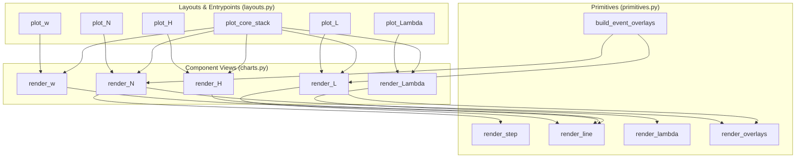

```mermaid
flowchart TD
    %% Layer 1: primitives (backend-adjacent)
    subgraph Layer1["Primitives (primitives.py)"]
        render_step
        render_line
        render_lambda
        render_overlays
        build_event_overlays
    end

    %% Layer 2: component views (chart recipes)
    subgraph Layer2["Component Views (charts.py)"]
        render_N
        render_L
        render_Lambda
        render_w
        render_H
    end

    %% Layer 3: layouts/entrypoints (core.py or layout module)
    subgraph Layer3["Layouts & Entrypoints (layouts.py)"]
        plot_N
        plot_L
        plot_Lambda
        plot_w
        plot_H
        plot_core_stack
    end

    %% Data helpers
    build_event_overlays --> render_N
    build_event_overlays --> render_L

    %% Views use primitives
    render_N --> render_step
    render_N --> render_overlays

    render_L --> render_line
    render_L --> render_overlays

    render_Lambda --> render_lambda

    render_w --> render_line

    render_H --> render_line

    %% Layout calls views
    plot_N --> render_N
    plot_L --> render_L
    plot_Lambda --> render_Lambda
    plot_w --> render_w
    plot_H --> render_H

    %% Composite stack orchestrates multiple views
    plot_core_stack --> render_N
    plot_core_stack --> render_L
    plot_core_stack --> render_Lambda
    plot_core_stack --> render_w
    plot_core_stack --> render_H
```
