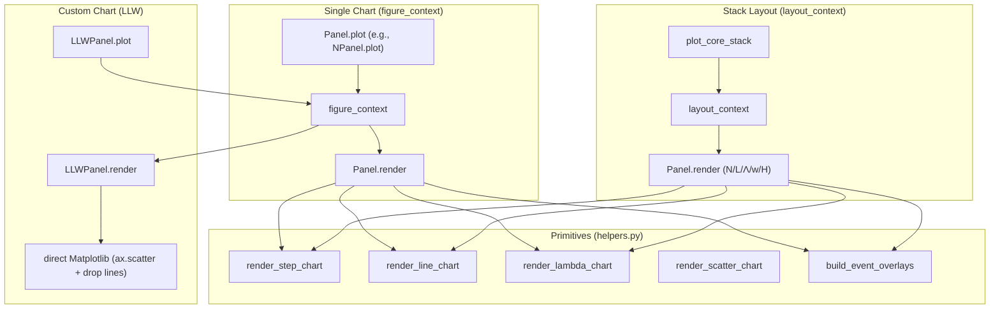

```mermaid
flowchart TD
    %% Primitives (helpers.py)
    subgraph Prims["Primitives (helpers.py)"]
        render_step_chart
        render_line_chart
        render_lambda_chart
        render_scatter_chart
        build_event_overlays
    end

    %% Single chart (standard figure context)
    subgraph Single["Single Chart (figure_context)"]
        SingleEntry["Panel.plot (e.g., NPanel.plot)"] --> figure_context
        figure_context --> PanelRender["Panel.render"]
        PanelRender --> render_step_chart
        PanelRender --> render_line_chart
        PanelRender --> render_lambda_chart
        PanelRender --> build_event_overlays
    end

    %% Stack (custom layout)
    subgraph Stack["Stack Layout (layout_context)"]
        StackEntry["plot_core_stack"] --> layout_context
        layout_context --> StackRender["Panel.render (N/L/Λ/w/H)"]
        StackRender --> render_step_chart
        StackRender --> render_line_chart
        StackRender --> render_lambda_chart
        StackRender --> build_event_overlays
    end

    %% Custom chart (LLW)
    subgraph Custom["Custom Chart (LLW)"]
        LLWEntry["LLWPanel.plot"] --> figure_context
        figure_context --> LLWRender["LLWPanel.render"]
        LLWRender --> Matplotlib["direct Matplotlib (ax.scatter + drop lines)"]
    end
```
