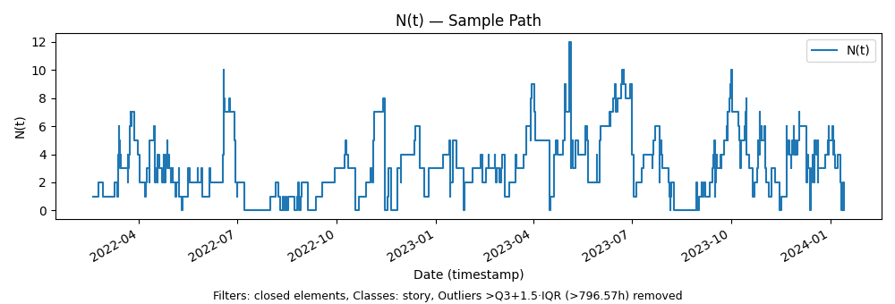
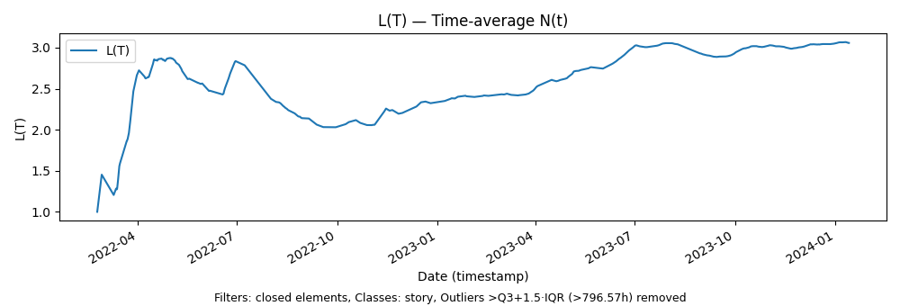
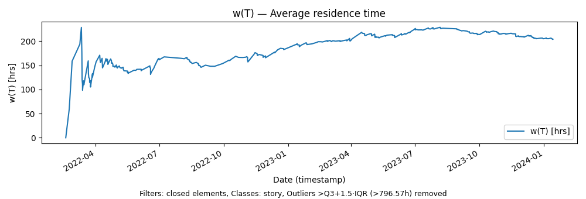
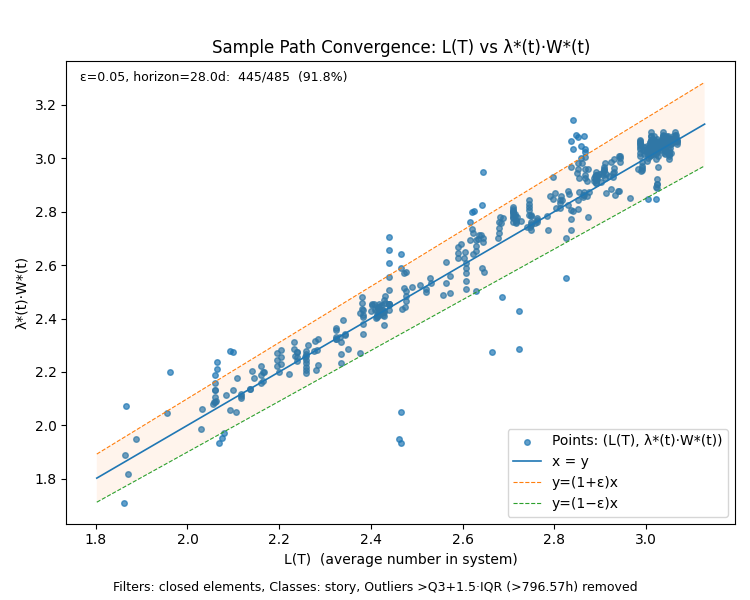

# Sample Path Chart Reference

This reference describes every chart produced by the `samplepath` CLI, grouped
by chart type. Each section includes cross-links back to the relevant CLI option
groups.


### Note: This is not statistics!

Sample path analysis is *not* statistical analysis. It takes continuous real-valued
measurements over a flow process based on observable behavior. These are functions that we reason about using the
tools of real
analysis: integrals, derivatives, limits, convergence—not statistical concepts
like averages, variances, or percentiles of assumed distributions.

This matters especially in stochastic process with
state, history and feedback mechanisms at play. This is common for flow processes
in complex adaptive systems. Here, statistical distributions are non-stationary and their moments shift continuously. In such
domains, sample path analysis and Little’s Law shine because they rely on
physical conservation principles that constrain *how these averages can evolve
over time*, regardless of the _nature of the underlying process_. 

A side effect of sample path analysis is that we can
observe a process as a black box and rigorously apply flow analysis even when a process
is not stable. In fact, we can determine how close or far away the process is to stability,
and thus determine whether standard statistical or probabilistic inference techniques can be applied. 

For flow processes in complex adaptive systems, particularly ones with humans in the loop, this
allows us to use Little’s Law for rigorous reasoning about the dynamics of the processes starting from 
_any_ arbitrary observation point. 

Note: All calculations are done in *continuous time* and all charts report time accumulations in hours.


The example charts in each section below are drawn from the Polaris scenario
[completed-stories-outliers-removed](../examples/polaris/flow-of-work/complete-stories-outliers-removed).
This example is discussed in detail in our post [Little's Law in a complex adaptive system](https://www.polaris-flow-dispatch.com/i/172332418/sample-path-analysis-a-worked-example)

## Core Flow Metrics - Finite Version of Little's Law

### Scenario root (top-level under `<scenario>/`)

| File | What it shows | What it means                                                                                                                                         |
| --- | --- |-------------------------------------------------------------------------------------------------------------------------------------------------------|
| `sample_path_flow_metrics.png` | Four-panel vertical stack: `N(t)`, `L(T)`, `Λ(T)`, `w(T)` over the same time axis. | One-glance view of the core finite-window Little’s Law metrics and how they co-evolve along the sample path.                                          |


---

## `core/` 
Each panel in the main chart is also written under
```
<scenario>/core/
```
Their detail descriptions follow. 

| File | What it shows | What it means                                                                                                                  |
| --- | --- |--------------------------------------------------------------------------------------------------------------------------------|
| `core/sample_path_N.png` | Step chart of `N(t)` (count of elements present in the boundary) vs time. | Raw sample path of WIP/presence: queues, surges, and droughts show up directly.                                                |
| `core/time_average_N_L.png` | Line chart of `L(T)` = time-average of `N(t)` over `[0, T]`. | Tracks how average WIP over the observation window converges (or doesn’t). This is the “L” in Little’s Law, measured pathwise. |
| `core/cumulative_arrival_rate_Lambda.png` | Line chart of `Λ(T)` (cumulative arrival rate `A(T)/(T−t₀)`), with optional percentile clipping and warmup exclusion. | Empirical demand rate over time, with tools to ignore early transients and outliers.                                           |
| `core/average_residence_time_w.png` | Line chart of `w(T)` (average residence time over the window, in hours). | Shows how the time items spend in the boundary evolves; long tails and slow drainage show up as increasing `w(T)`.             |
| `core/littles_law_invariant.png` | Scatter of `L(T)` (x-axis) vs `Λ(T)·w(T)` (y-axis) with `y=x` reference line, equal aspect ratio. | Pure Little’s Law invariant check: all finite points should lie near `y=x` if the metric calculations are consistent.          |


### `sample_path_N.png`
Instantaneous WIP `N(t)`. This shows the number of items observed
at time t. 

Since we measure in continuous time, this chart
is a *step chart*. 
- The line will go up with each arrival and go down with each departure. 
- The line will stay steady if departures and arrivals balance each other at a given instant. 
- In between arrivals and departures, the line will stay flat. 

This is a real time chart that reveals current congestion, bursts, and idle periods.



### The area under the sample path
A key quantity in sample path analysis is the *area under the sample path*.
This is calculated as the definite integral of the sample path curve over [0,T] 

```
H(T) = ∫₀ᵀ N(t) dt
```

Since the area is a product of the number of items present over time, the units of H(T) are in item-time.
H(T) is itself not very interesting to chart since this is simply a monotonically increasing function of time. 

Rather, the parameters that drive flow-process dynamics are the time and item averages
of H(T): L(T) and w(T).  These continuous functions of time are 
the key quantities in the _finite version of Little’s Law_. 


### `time_average_N_L.png`
Time-average WIP:

`L(T)` is the time average of the area under the sample path. May also be viewed as the rate at which the area H(T) grows. 

Its units are in items. 

```
L(T) = (1/T) H(T)
```

Reveals whether long run average WIP diverges or converges. This is the key top level indicator of process stability. A flat line here indicates
a stable process. 

Please note once again that this is _not a statistical average_. 



### `cumulative_arrival_rate_Lambda.png`
 `Λ(T)` is the arrival rate of items that have arrived up to T (may include items that started before the window):

```
Λ(T) = A(T) / T
```

It's units are items/time

If WIP was zero at the beginning of the observation window, then this is the same as the arrival rate, otherwise
this over-counts the arrival rate at the start, but as we observe the process for longer periods, those initial
end-effects get averaged out. 


### `average_residence_time_w.png`
Average time items are observed as spending in the observation window up to time T (clips the time that is spent outside the window and thus
not observed). 


```
w(T) =  H(T)/A(T)
```

Tracks how “observed time in system” evolves over the sample path. Its units are time/items

Please see our posts [What is Residence Time](https://www.polaris-flow-dispatch.com/p/what-is-residence-time)
and [How long does it take](https://www.polaris-flow-dispatch.com/p/how-long-does-it-take) for an explanation
of what this metric means. 

_Understanding the difference and relationship between residence time and familiar
metrics like Lead Time, Cycle Time and Work Item Age is crucial for understanding why sample path analysis works
and these posts explain this._ 




### `littles_law_invariant.png`

This plot visualizes the [finite version of Little's Law](https://www.polaris-flow-dispatch.com/i/172332418/the-finite-version-of-littles-law) at work. 

It states that for all T, `L(T)=Λ(T)·w(T)`.

We verify this by showing that when we plot `L(T)` vs `Λ(T)·w(T)` on a scatter plot, 
all the points will lie on the with `y = x`.  


Notice how points cluster around certain values of L(T). These are significant operating
modes for the process as it moves towards a stable states.

### `sample_path_flow_metrics.png`
Four-panel summary:

1. `N(t)`
2. `L(T)`
3. `Λ(T)`
4. `w(T)`

The four charts are summarized at the top level in one single chart. 


In this chart the main thing to pay attention to are the _relationships_
between the _changes_ in each of these component charts over time. 

At any point in time, the relationship  `L(T)=Λ(T)·w(T)` holds, 
so if `L(T)` changes Little's Law invariant states that it must be one of the following

- Arrival rate driven: more or fewer things are arriving.
- Residence time driven: things are taking longer to finish. 
- A combination of the two: since L(T) is the product of the two, even small changes in each one simultaneously can lead to apparently large changes in L(T)
- Conversely, when Λ(T) and w(T) move in opposite directions, they cancel each other and L(T) appears flat. This happens often when there is a feedback loop at play in the process. 

then it must be because either `Λ(T)` or `w(T)` or both changed. 
This allows us to monitor changes in L(T) and then immediately investigate
the cause of that change. 

All these different types of dynamics can be at play at different points in the evolution of the process. This chart is the place
where all those long run dynamics will show most directly and clearly. 

---

## Convergence - Equilibrium & coherence


| File | What it shows | What it means                                                                                                                                         |
| --- | --- |-------------------------------------------------------------------------------------------------------------------------------------------------------|
| `sample_path_convergence.png` | Scatter of `L(T)` (x-axis) vs `λ*(t)·W*(t)` (y-axis) with `y=x` and an ε-band; annotated with a coherence score over a horizon. | Direct visual and quantitative test of whether the finite-window sample path obeys Little’s Law asymptotically (sample-path convergence / coherence). |




| File | What it shows | What it means                                                                                                                               |
| --- | --- |---------------------------------------------------------------------------------------------------------------------------------------------|
| `convergence/arrival_departure_equilibrium.png` | Two-row stack: (1) cumulative arrivals `A(t)` vs cumulative departures `D(t)`; (2) `Λ(T)` vs throughput rate `θ(T)=D(T)/(T−t₀)` with masking after last departure. | Tests arrival/departure equilibrium: whether `A(t)` and `D(t)` grow together and arrival/throughput rates converge.                         |
| `convergence/panels/arrival_rate_convergence.png` | Single panel: `Λ(T)` and `λ*(t)` (empirical arrival rate) over time, with optional warmup and percentile-based y-limits. | Compares window-averaged arrival rate to the element-wise empirical rate; checks consistency of the two ways of measuring “arrival rate”.   |
| `convergence/panels/residence_time_convergence.png` | Single panel: `w(T)` vs `W*(t)` (empirical mean sojourn time of completed items) over time. | Coherence between residence-time and sojourn-time views: if the process is coherent, these two series should converge together.             |
| `convergence/residence_sojourn_coherence.png` | Two-row stack: (1) `w(T)` vs `W*(t)` overlay; (2) scatter of individual sojourn times against time, with `w(T)` as a reference line. | Ties the averaged quantities back to individual element sojourn times; helps see whether outliers or subpopulations are driving divergence. |
| `convergence/panels/residence_time_sojourn_time_scatter.png` | Line of `w(T)` over time with overlaid scatter of element *age* (if `--incomplete`) or sojourn time (if `--completed` / default). | Visualizes how individual element ages/sojourn times relate to the evolving average residence time, and whether a stable band emerges.      |

---

## `advanced/` — Error terms, end-effects, and manifold view

| File | What it shows | What it means                                                                                                                                                                         |
| --- | --- |---------------------------------------------------------------------------------------------------------------------------------------------------------------------------------------|
| `advanced/residence_convergence_errors.png` | Three-row stack: (1) `w(T)` vs `W*(t)` (dynamic); (2) `Λ(T)` vs `λ*(t)` (dynamic); (3) error magnitudes `e_W(T)` and `e_Λ(T)` with optional ε threshold. | Tracks *how* coherence is approached or violated, with explicit error terms for residence time and arrival rate over time.                                                            |
| `advanced/residence_time_convergence_errors_endeffects.png` | Four-row stack: same as above plus an end-effects panel with `r_A(T)` (mass share), `r_B(T)` (boundary share), and `ρ(T)=T/W*(t)`. | Decomposes residual errors into end-effect contributions and time-scaling, making it clear when divergence is driven by boundary conditions vs ongoing dynamics.                      |
| `advanced/invariant_manifold3D_log.png` | 3D log–log–log manifold plot: `x = log Λ(T)`, `y = log w(T)`, `z = log L(T)`, plotting the sample-path trajectory on the plane `z = x + y`. | Geometric view of Little’s Law as an invariant plane; lets you see whether the observed trajectory sticks to the manifold and how it moves across regimes in (rate, time, WIP) space. |

---

## `stability/` and `stability/panels/` — Rate stability

| File | What it shows | What it means                                                                                                                                                     |
| --- | --- |-------------------------------------------------------------------------------------------------------------------------------------------------------------------|
| `stability/panels/wip_growth_rate.png` | Two-row stack: (1) `N(t)` step chart; (2) WIP growth rate `N(T)/T` with reference lines at 0 and 1. | Tests whether WIP grows linearly (instability) or sublinearly/flat (bounded or stabilizing), using a rate perspective.                                            |
| `stability/panels/total_age_growth_rate.png` | Two-row stack: (1) total active age `R(t)` in hours; (2) age growth rate `R(T)/T` with reference lines at 0 and 1. | Looks at growth of total age of WIP: sustained growth points to accumulating, aging work and potential instability.                                               |
| `stability/rate_stability.png` | Four-row stack: (1) `N(T)/T`; (2) `R(T)/T`; (3) `λ*(T)`; (4) `w(T)` vs `W*(t)`. Captioned “Equilibrium and Coherence”. | Integrated stability view: WIP and age growth rates, empirical arrival rate, and residence/sojourn coherence all on one canvas to assess long-run rate stability. |

---

# Chart details


---

# Convergence Charts

Written under:

```
<scenario>/convergence/
<scenario>/convergence/panels/
```

---

## `convergence/arrival_departure_equilibrium.png`
Cumulative arrivals vs departures, plus arrival/throughput rate comparison.  
Tests for equilibrium.

## `convergence/panels/arrival_rate_convergence.png`
`Λ(T)` (window-average) and `λ*(t)` (empirical).  
Checks rate consistency.

## `convergence/panels/residence_time_convergence.png`
`w(T)` vs `W*(t)`.  
Coherence between window-average residence and empirical sojourn time.

## `convergence/residence_sojourn_coherence.png`
Two-row comparison of averages + individual sojourn scatter.

## `convergence/panels/residence_time_sojourn_time_scatter.png`
`w(T)` overlaid with individual ages or sojourns.

## `sample_path_convergence.png`
Scatter of `L(T)` vs `λ*(t)·W*(t)` with tolerance band.  
Highest-level convergence and coherence view.

Controlled by **Convergence Options**:  
`--convergence`, `--coherence-eps`, `--completed`, `--incomplete`, `--warmup`.


---


# Stability Charts

Written under:

```
<scenario>/stability/
<scenario>/stability/panels/
```

Controlled by **Stability Options**: `--stability`.

## `stability/panels/wip_growth_rate.png`
`N(t)` and its growth rate `N(T)/T`.  
Detects sublinear vs linear growth.

## `stability/panels/total_age_growth_rate.png`
Total age `R(t)` and its growth rate.  
Identifies aging accumulation.

## `stability/rate_stability.png`
Four-panel stability synthesis:

- `N(T)/T`
- `R(T)/T`
- `λ*(T)`
- `w(T)` vs `W*(t)`

---

# Advanced Charts

Written under:

```
<scenario>/advanced/
```

Controlled by **Advanced Options**: `--advanced`.

## `advanced/residence_convergence_errors.png`
`w(T)` vs `W*(t)`;  
`Λ(T)` vs `λ*(t)`;  
error magnitudes.

## `advanced/residence_time_convergence_errors_endeffects.png`
Adds end-effects: `r_A(T)`, `r_B(T)`, `ρ(T)`.

## `advanced/invariant_manifold3D_log.png`
3D log–log–log manifold:  
`(log Λ(T), log w(T), log L(T))` on the plane `z = x + y`.

---