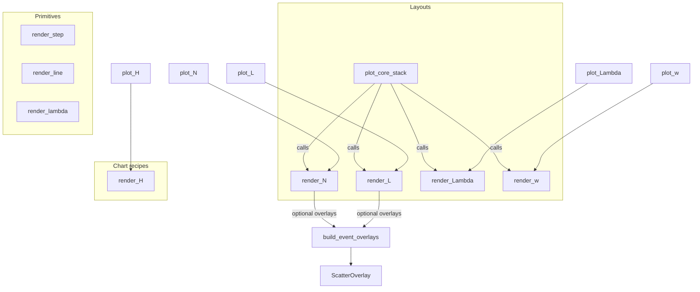

```mermaid
flowchart TD
    subgraph CoreFunctions[Layouts]
        plot_core_stack -->|calls| render_N
        plot_core_stack -->|calls| render_L
        plot_core_stack -->|calls| render_Lambda
        plot_core_stack -->|calls| render_w
    end

    subgraph Helpers[Primitives]
        render_step
        render_line
        render_lambda
    end

    subgraph Recipes[Chart recipes]
        render_N
        render_L
        render_Lambda
        render_w
        render_H
    end

    %% Standalone layouts
    plot_N --> render_N
    plot_L --> render_L
    plot_Lambda --> render_Lambda
    plot_w --> render_w
    plot_H --> render_H

    %% Overlay builder
    render_N -->|optional overlays| build_event_overlays
    render_L -->|optional overlays| build_event_overlays

    %% Underlying overlays
    build_event_overlays --> ScatterOverlay
```
